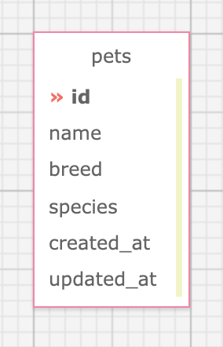

# _Animal Shelter API_

#### _Ruby week 6 Code Review project for Rails API lesson at Epicodus Bootcamp_

#### Created By: **Christopher Neal**

## Technologies Used

* _Ruby_
* _Gems_
* _Bundler_
* _RSpec_
* _shoulda-matchers_
* _IRB_
* _Pry_
* _Postgres_
* _SQL_
* _SQL Designer_
* _Rails_
* _Faker_
* _Will Paginate_
* _Factory Bot_

## Description

_This project was created for Epicodus bootcamp to show proficiency in Rails APIs. The application is an API for users to retrieve listings of pets in an animal shelter._
_All users can access animal shelter pet listings and post, update, delete listings. CORS is enabled for all origins but restricted to GET method only. There are endpoints to search by pet name, filter by species, and retrieve a random pet._

## System Requirements

* Ruby v2.6.5 recommended
* Postgres 12.9  
* Postman
_(Note: Ruby gem dependencies will be installed automatically by Bundler.)_

## Setup/Installation Requirements

* Clone the GitHub repository: [https://github.com/ChristopherMNeal/animal_shelter_api](https://github.com/ChristopherMNeal/animal_shelter_api)
* From the main project directory, enter `bundle install` in the terminal to populate gems.
* To create a database, type in your terminal: 
      `rake db:setup`
* Enter `rspec` into the terminal to confirm passing of all tests.
* Run `rails s` to start the Rails server.
* Open Postman to try out the following endpoints.

## Endpoints
*example URLs use `species=Cat` `name=Brad` and `page=1` as parameters*

|Usage | METHOD       | URL       | Params |
| :--------|:------------| :---------| :------|
|See All Pet Listings | GET    | `localhost:3000/api/v1/pets` | |
|See Pet Paginated Listings | GET    | `localhost:3000/api/v1/pets?page=1` | *page* |
|See A Specific Pet Listing | GET    | `localhost:3000/api/v1/pets/:id` | |
|Search By Pet Name | GET    | `localhost:3000/api/v1/pets?name=Brad&page=1` | *name, page* |
|Search By Pet Species | GET    | `localhost:3000/api/v1/pets?species=Cat&page=1` | *species, page* |
|See A Random Pet | GET    | `localhost:3000/api/v1/pets/random` | |
|Create a Pet Listing | POST    | `localhost:3000/api/v1/pets` | *name, content* |
|Update a Pet Listing | PUT    | `localhost:3000/api/v1/pets/:id` | *name, content* |
|Delete a Pet Listing | DELETE    |`localhost:3000/api/v1/pets/:id`| | 

Species filter is limited to `Cat` `Dog` & `Bunny` and is case sensitive.
Name search is case insensitive and will match similar names.

## Responses

When getting a single pet listing, expect the response to look like:

```
[
    {
        "id": integer,
        "name": string,
        "species": string,
        "created_at": timestamp,
        "updated_at": timestamp,
        "breed": string
    }
]
```

|Column | Must Be Present?       |  Validations      | 
| :--------|:------------| :---------| 
|name | true    | 25 Characters Maximum |
|species | true    | Can only be 'Cat' 'Dog' or 'Bunny' |
|breed | true    | 50 Characters Maximum |

## Database Schema



## Known Bugs

* _None at this time._

## License

_[MIT](https://opensource.org/licenses/MIT)_
Copyright (c) _2022_ _Christopher Neal_

## Support and Contact Details
* _[christopher.m.neal@gmail.com](mailto:christopher.m.neal@gmail.com)_